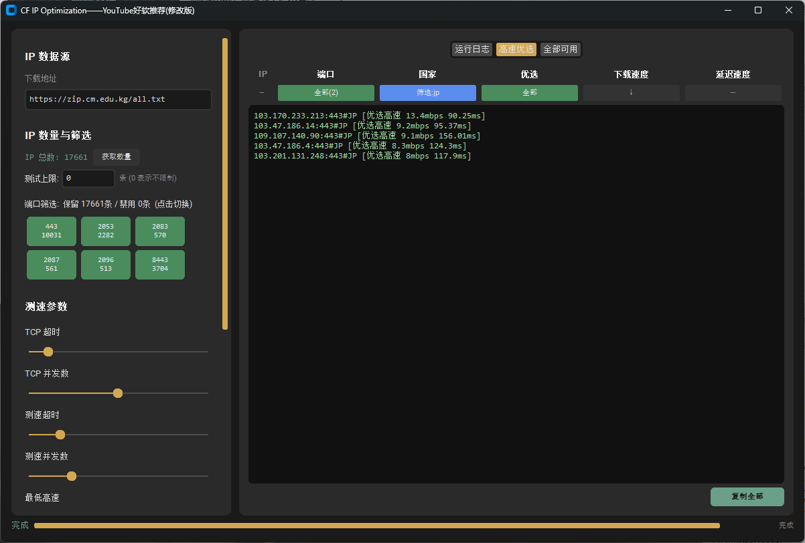

# CF IP Optimization —— YouTube好软推荐(修改版)

Cloudflare 优选 IP 测速工具 GUI 版。基于原版 `Cloudflare优选IP_by YouTube好软推荐` 优化改进。
本项目基于原作者 [ethgan](https://github.com/ethgan) 的开源项目 [CF-ips-scanner](https://github.com/ethgan/CF-ips-scanner) 进行二次开发与优化。

在此对原作者的开源贡献表示诚挚的感谢！

## 功能特性

- **IP 测速**：基于 update.exe 引擎，自动测试 Cloudflare IP 的 TCP 延迟和下载速度
- **结果分类**：自动区分「高速优选」和「全部可用」结果
- **筛选过滤**：
  - 按端口筛选（支持多选切换）
  - 按国家筛选（支持多选切换，如 `JP,US,GB` 多值匹配）
  - 自定义文字筛选（实时过滤结果显示）
  - 优选模式切换（仅显示高速节点）
- **排序**：按下载速度 / 延迟速度升序或降序排列
- **UI 优化**：
  - 深色主题界面
  - 实时日志输出
  - 过滤状态可视化按钮
  - 弹出菜单自动失焦关闭

## 截图

## 使用方法

1. 打开软件，选择工作目录（默认 `_cf_run`）
2. 配置测试参数：并发数、延迟上限、速度下限等
3. 点击「开始测试」按钮
4. 测试完成后可在「高速优选」和「全部可用」标签页查看结果
5. 使用过滤/排序功能筛选所需节点

## 系统要求

- Windows 7 / 8 / 10 / 11
- 依赖：`curl.exe`（已内嵌）、`update.exe`（已内嵌）

## 文件说明

| 文件 | 说明 |
|------|------|
| `CF IP Optimization——YouTube好软推荐(修改版).exe` | 主程序（单文件，免安装） |
| `11.png` | 界面截图 |
| `ips.txt` | 待测 IP 列表（可自行替换） |

## 与原始版本的区别

- 增加了过滤/排序栏（端口、国家、优选模式、下载速度、延迟速度）
- 支持自定义文字筛选（多值逗号分隔）
- 弹出菜单点击外部自动关闭
- Bug 修复与 UI 改进
